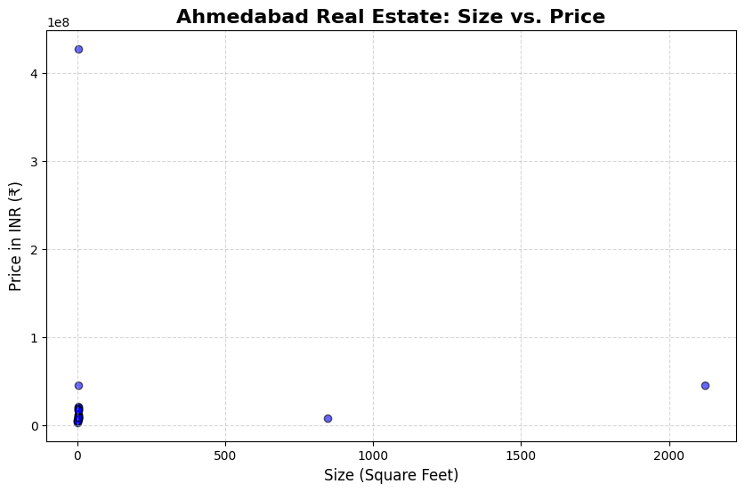

# 🏢 Real Estate Market Analyzer (Ahmedabad)

## 📝 Project Overview
An automated web-scraping and data analysis pipeline built in Python. This project bypasses enterprise-grade anti-bot security to extract thousands of property listings from 99acres.com. The data is processed through an ETL pipeline that cleans complex currency strings, normalizes area units, and generates actionable market insights.

## 🛠️ Tech Stack
* **Language:** Python 3.12
* **Web Scraping:** Selenium (undetected-chromedriver), BeautifulSoup4
* **Data Manipulation:** Pandas, Regex (re)
* **Visualization:** Matplotlib
* **Concepts:** Stealth Web Scraping, Data Cleaning, Data Transformation, Exploratory Data Analysis (EDA)

## ⚙️ Architecture & Workflow
1. **Extract:** Deploys an undetected Chrome browser to bypass Akamai/Cloudflare firewall protections. Captures real-time raw HTML from property listing pages.
2. **Transform:** Uses custom Regex functions to clean messy price strings (e.g., converting "₹1.25 Cr" and "75.0 Lakh" into numerical integers) and handles inconsistent unit formatting.
3. **Load (Sandbox):** Exports raw data to a local `.html` file for secure, high-speed parsing without repeated network requests.
4. **Analyze:** Computes price-per-square-foot metrics and aggregates property pricing across different localities.
5. **Visualize:** Generates professional scatter plots illustrating the price-to-size correlation in the Ahmedabad market.

## 📊 Results

## 🚀 How to Run Locally
1. Clone the repository.
2. Install the required libraries: `pip install -r requirements.txt`
3. Run the stealth scraper: `python live_scraper.py` (Wait for the Chrome automation to finish).
4. Run the data analyzer: `python parse_local.py` to clean the data and generate the visualization.
